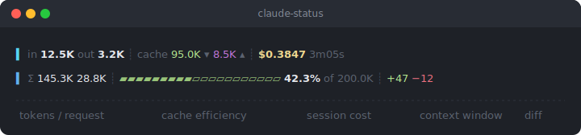
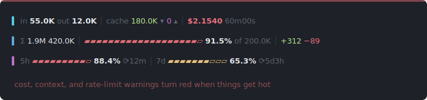

<div align="center">

# claude-status

**Know what you're burning.**

A live status line for [Claude Code](https://docs.anthropic.com/en/docs/claude-code) that shows token usage, cost, cache hits, and context window pressure — updated after every response.

[](LICENSE)
[](claude-status.sh)
[](claude-status.sh)

</div>

<br>

<p align="center">
  
</p>

<br>

## Install

```bash
git clone https://github.com/kukushking/claude-status.git
cd claude-status
bash install.sh
```

Restart Claude Code. That's it.

<details>
<summary><b>Manual install</b></summary>

<br>

```bash
cp claude-status.sh ~/.claude/claude-status.sh
chmod +x ~/.claude/claude-status.sh
```

Add to `~/.claude/settings.json`:

```json
{
  "statusLine": {
    "type": "command",
    "command": "~/.claude/claude-status.sh"
  }
}
```

</details>

<details>
<summary><b>Uninstall</b></summary>

<br>

```bash
bash uninstall.sh
```

</details>

<br>

## What you see

```
▍ in 12.5K   out 3.2K    ┊  cache 95.0K ▾  8.5K ▴  ┊  $0.3847  3m05s
▍ Σ  145.3K       28.8K  ┊  ▰▰▰▰▰▰▰▰▰▱▱▱▱▱▱▱▱▱▱▱ 42.3% of 200.0K  ┊  +47 −12
▍ 5h ▰▰▰▱▱▱▱▱▱▱ 23.5% ⟳2h14m  ┊  7d ▰▰▰▰▱▱▱▱▱▱ 41.2% ⟳3d2h
```

**Line 1** — the last request:

| Element | Meaning |
|---|---|
| `▍` (cyan) | Visual accent for current request line |
| `in 12.5K` | Input tokens sent to Claude in the last request |
| `out 3.2K` | Output tokens Claude generated in the last response |
| `cache 95.0K ▾` | Tokens read from cache — saves money |
| `8.5K ▴` | Tokens written to cache — costs upfront, saves later |
| `$0.3847` | Cumulative session cost in USD |
| `3m05s` | Session duration |

**Line 2** — the full session:

| Element | Meaning |
|---|---|
| `▍` (blue) | Visual accent for session totals line |
| `Σ 145.3K` / `28.8K` | Total input and output tokens across all requests |
| `▰▰▰▱▱▱` | Context window usage bar |
| `42.3% of 200.0K` | Percentage of context window used / max window size |
| `+47` / `−12` | Lines of code added / removed this session |

**Line 3** — Claude.ai rate limits (only shown when present; requires Claude Code 2.1.80+ and a Pro/Max subscription):

| Element | Meaning |
|---|---|
| `▍` (magenta) | Visual accent for rate-limit line |
| `5h ▰▰▰▱▱▱▱▱▱▱ 23.5%` | Usage in the rolling 5-hour window |
| `⟳2h14m` | Time until the 5-hour window resets |
| `7d ▰▰▰▰▱▱▱▱▱▱ 41.2%` | Usage in the weekly window |
| `⟳3d2h` | Time until the weekly window resets |

<br>

## Color coding

Everything shifts color as you burn through tokens:

| Metric | Green | Yellow | Red |
|--------|-------|--------|-----|
| **Cost** | < $0.25 | < $1.00 | > $1.00 |
| **Context** | < 50% | < 80% | > 80% |
| **Rate limit** | < 50% | < 80% | > 80% |

When things get hot:

<p align="center">
  
</p>

<br>

## How it works

Claude Code's [status line](https://docs.anthropic.com/en/docs/claude-code/status-line) pipes session data as JSON to a shell script after every assistant response. `claude-status` parses that JSON and renders a color-coded 2-line display.

No API calls. No external dependencies beyond Python 3 and Bash. Runs locally.

<br>

## Requirements

- [Claude Code](https://docs.anthropic.com/en/docs/claude-code)
- Python 3
- Bash

<br>

## License

[MIT](LICENSE)
